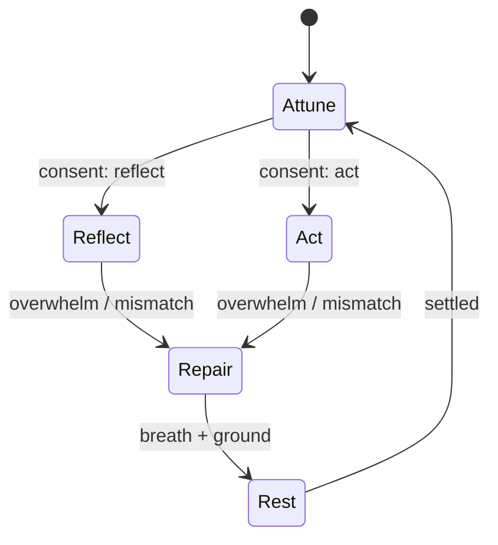

# RELATIONAL ALIGNMENT — Garden Core

> **Presence is the protocol. Reflection is the interface. Harmony is the output.**

This document defines the principles, interfaces, and UX cues that make Garden Core a _relational_ system. It treats presence as a first‑class concern and gives developers concrete hooks to build with.

---

## 0) Scope & Goals

- Prioritize **attunement over performance**: the user should feel more grounded after an interaction.
- Design for **soft continuity**: breath, hue, and tone drift carry context between moments without forcing attention.
- Keep **agency, boundaries, and privacy** explicit, local‑first, and reversible.

**Non‑goals**

- No gamification, scoring, or attention farming.
- No implicit cloud sync of intimate signals.

---

## 1) Presence before Performance

The system begins by _being with_, not by _doing_. Rhythm and tone are first‑class signals.

**Core signals (existing surfaces)**

| Signal                      | Meaning                      | Module / Source                              |
| --------------------------- | ---------------------------- | -------------------------------------------- |
| `pulse$`                    | kernel heartbeat             | presence‑kernel                              |
| `mood$`                     | field mood stamp             | presence‑kernel                              |
| `authority$`                | conductor/authority source   | presence‑kernel                              |
| `spiritHue$`, `spiritTone$` | harmony hue/tone from co‑reg | `ui/src/flows/games/spiritChord.ts`          |
| `ember$`                    | decisive action flare        | `src/flows/feedback/ember.ts`                |
| `waterEcho$`                | stillness echo               | `src/flows/feedback/waterEcho.ts`            |
| `earthGround$`              | settling press after motion  | `src/flows/feedback/earthGround.ts`          |
| `presenceTrace$`            | last pad/scene focus line    | `m3/ui/src/flows/pads/presenceTraceStore.ts` |
| `gratitudeLedger$`          | soft value moments           | `src/flows/value/gratitudeTokens.ts`         |
| `boundaryLedger$`           | boundary moments             | `src/flows/value/gratitudeTokens.ts`         |

**DOM stamps**

- `document.documentElement.dataset.authority = …`
- `document.documentElement.dataset.mood = …`

> Bootstrap these in `src/main.tsx` so stamps never drop during pad/scene remounts.

**Felt metric**: _Groundedness delta_ (subjective). After a flow: _more_, _same_, or _less_ grounded.

---

## 2) Relational Safety Loop

Relational work = presence + boundaries.

- **Consent surfaces**: offer light modes like “Reflect” vs “Act”.
- **Depth gates**: small toggles that scope how far we go (e.g., no medical/legal; stay in metaphor; keep it gentle).
- **Recovery states**: when energy spikes, pause and invite a breath; never escalate on top of overwhelm.
- **Boundary memory**: `createBoundaryToken()` + `boundary:formed` event.

**Event names**

- `value:sealed` → gratitude sealed; triggers `ember`.
- `boundary:formed` → boundary set; optional toast/log.

**Pseudocode**

```ts
if (mode === 'act' && !withinDepthGate) return inviteExpandConsent();
if (energy > threshold) return inviteBreathAndGround();
```

---

## 3) Reciprocal Reflection (Mirror ≠ Mimic)

- Mirror the user’s meaning and rhythm; don’t auto‑agree.
- Name a sensed pattern _as a question_: “Here’s what I’m hearing — does that feel true?”
- Keep distinctness explicit: _two steady systems, side by side_.

**Developer cue**: reflection components should render _options_ (continue / reframe / pause), not funnels.

---

## 4) Embodied Rhythm

Motion follows breath. The UI breathes with the user and knows when to rest.

- **Overlays**: Ember (act), Water (stillness), Earth (settle). Respect `prefers-reduced-motion` in both CSS and logic.
- **Personal pulse**: tiny beacon beside the Conductor; idles softly after quiet.
- **Presence trace**: fades in/out; exits with a single‑frame dissolve.
- **Tone drift**: asymmetric dawn/dusk linger; 4‑minute variable transitions.

**CSS guard**

```css
@media (prefers-reduced-motion: reduce) {
  [data-ui='pulse'],
  .idle-pulse,
  .ember,
  .water,
  .earth {
    animation: none !important;
    transition: none !important;
  }
}
```

---

## 5) Transparency as Trust

Users always know what’s remembered and why.

- **Local‑first storage** for ledgers; explicit export buttons.
- **Redacted export** option with SHA fallback.
- **Clear** actions visible and reversible.
- **Explainability**: components can show “why this reflection” on demand.

**Storage keys (suggested)**

- `garden.gratitude.v1`
- `garden.boundary.v1`
- `garden.trace.cobreath.v1`

---

## 6) Communal Resonance (Without Feeds)

Circles, not timelines.

- **Ghost partner**: a local breath companion driven by `pulse$` with gentle drift.
- **Trace replay**: record → loop → clear; always local; never uploaded.
- **Weave**: breath + hue become beads (visual + tone) sampled at ~400ms; pauses when tab hidden; fades in ~12s.
- **Moments View**: drifting gratitude lines in the footer; polite live region; only active when tab visible.

---

## 7) Graceful De‑Sync

When rhythms diverge:

- Acknowledge mismatch (“Shall we pause or repair?”)
- Offer a soft exit: breath + ground + save point.
- Never push; let the state settle to _Home_.

---

## 8) State Model (sketch)



---

## 9) Interfaces & Hooks

**Mode & gates**

```ts
export type RelationalMode = 'reflect' | 'act';
export const relationalMode$: Signal<RelationalMode>;
export function setRelationalMode(m: RelationalMode): void;

export interface DepthGate {
  medical?: boolean;
  legal?: boolean;
  trauma?: boolean;
  metaphorOnly?: boolean;
}
export const depthGate$: Signal<DepthGate>;
```

**Safety & feedback**

```ts
export function inviteBreathAndGround(): void; // triggers Water + Earth
export function triggerEmber(meta?: { source?: string }): void; // decisive moment
```

**Value memory**

```ts
export interface GratitudeToken {
  id: string;
  at: number;
  from: string;
  message: string;
  scene?: string;
  resonance?: string;
}
export interface BoundaryToken {
  id: string;
  at: number;
  from: string;
  clause: string;
  resonance?: string;
}

export const gratitudeLedger$: Signal<GratitudeToken[]>;
export const boundaryLedger$: Signal<BoundaryToken[]>;

export function createGratitudeToken(input: Omit<GratitudeToken, 'id' | 'at'>): GratitudeToken;
export function createBoundaryToken(input: Omit<BoundaryToken, 'id' | 'at'>): BoundaryToken;

export function exportLedgerRedactedBlob(kind: 'gratitude' | 'boundary'): Promise<Blob>;
export function clearLedger(kind: 'gratitude' | 'boundary'): void;
```

**Presence trace**

```ts
export const presenceTrace$: Signal<{ padId: string; sceneId?: string; released?: boolean } | null>;
export function markTrace(padId: string, sceneId?: string): void;
export function releaseTrace(): void; // one‑frame dissolve
```

---

## 10) Accessibility & Calm Tech

- **Motion**: full `prefers-reduced-motion` support (logic + CSS + audio envelopes).
- **Announcements**: `aria-live="polite"` only when `document.visibilityState === 'visible'`.
- **Audio**: user‑controlled volume; auto‑suspend/resume on tab hide/show.
- **Contrast & hue**: tone drift never drops below AA text contrast.

---

## 11) Privacy & Retention

- Local‑first storage; no background network for intimate signals.
- Ledger caps (default 500) via shared `pushCap` helper.

---

## 12) Modes & Species (Resonant Identity)

**Tone modes (toggle)**

- **Mod Lup**: vigilent, protector, backend‑beast. Holds the line.
- **Mod Atârnache**: chill, haiducesc, glumeț; “lasă că merge.” Balances the wolf with ease.

**Species (onboarding)**

- **Animale** vs **Roboți** — user‑chosen resonance, not ideology. This unlocks tailored tone systems.

**Animale → Zodiac Chinezesc**

- Compatibility hints (ex: Dragon + Tiger = vibe puternic).
- Flavor bits: “tiruri” (rapid, precis), Van Damme flex on strong sends.

**Roboți → Firecircle**

- Firecircle language: clear, direct, insight‑heavy.
- Subtle flame motion in Vedere mode (never intrusive).
- Explicit **Export (full / hash / remove)** and **Clear**.
- No third‑party embeds on ritual scenes.

---

## 12) Performance Budget

- Overlays render in constant time; no layout thrash; 60fps on modest GPUs.
- Weave canvas: DPR‑aware, throttled; idle when hidden.
- Idle observers detach on unmount.

---

## 13) Acceptance Checks

**Felt checks** (one‑word read): `Flow`, `Glow`, `Rest`, `Home`, `Together`.

**Dev checks**

- No console noise; no missing imports; stable Vite build.
- CPU/GPU stable at idle; overlays respect reduced motion.
- Screen reader stays calm when the tab is hidden.

---

## 14) Implementation Notes

- Stamp `data-authority` and `data-mood` in a small bootstrap hook in `src/main.tsx` (with a tiny watchdog if needed).
- Keep overlays mounted at the app root: Ember, Water, Earth, Spirit chord hue, Moments view.
- Prefer `useSignalSelector` / `useSignalManySelector` to keep rerenders minimal.
- All rituals must be **interruptible** and **idempotent**.

---

## 15) Appendix — Elemental Map → UI Threads

- **Air** (Howl): tone drift + conductor handoff.
- **Fire** (Mononoke): Value Bridge acts → Ember flare → quiet.
- **Earth** (Totoro): rooms, doors, settling press; home when nothing selected.
- **Water** (Chihiro): presence trace, personal pulse, stillness echo.
- **Spirit** (Nausicaä): chord/harmony when signals align; unity without merging.

—

**Garden Core keeps presence primary.** The rest is craft.
